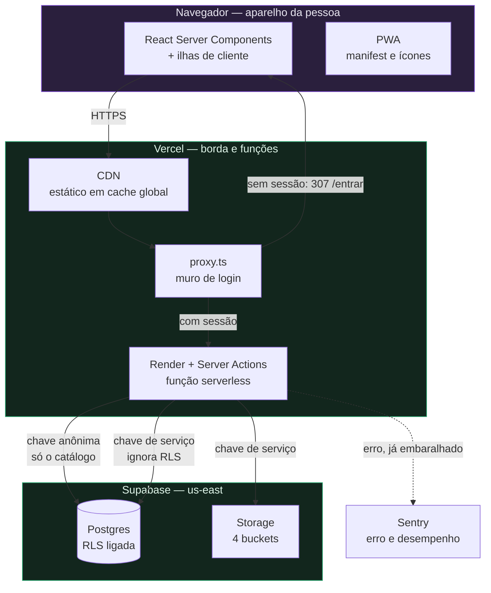
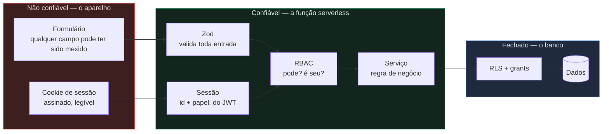
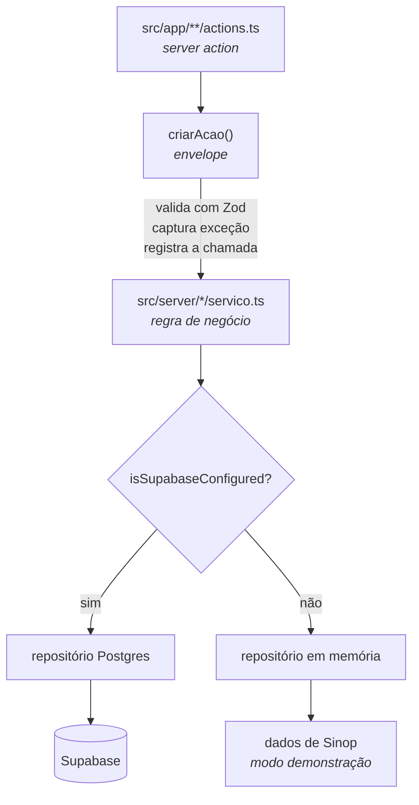
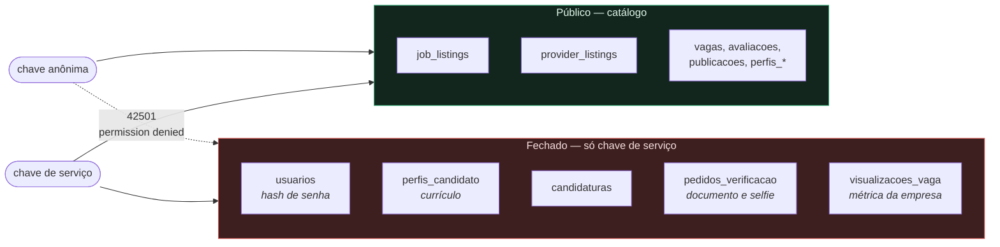
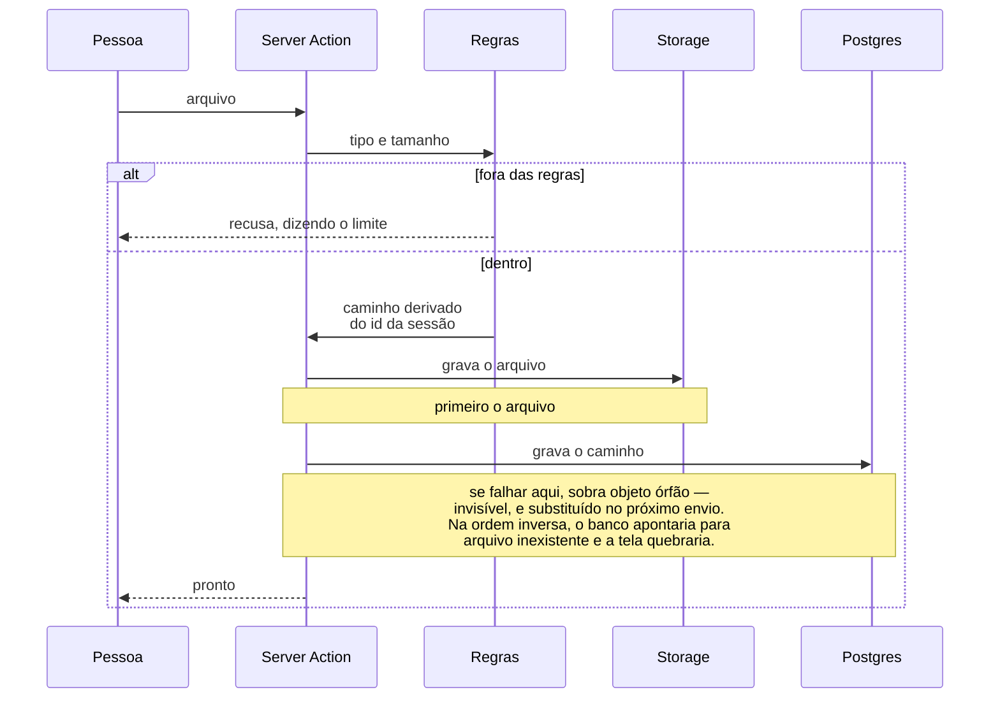

# Arquitetura

O que roda onde, por onde passa dado sensível, e o que acontece quando cada
peça cai.

Este documento existe para alguém novo entender o sistema sem ler o código
inteiro. O *porquê* de cada decisão está no [AGENTS.md](../AGENTS.md); aqui
está o *desenho*.

Os diagramas são Mermaid, que o GitHub renderiza sozinho — sem dependência
nova e sem passo de build.

---

## 1. O que roda onde

**O navegador nunca fala com o Supabase.** Nem com o Postgres, nem com o
Storage. Tudo passa pela função serverless. É o que permite decidir no
servidor quem pode ler o quê, em vez de deixar a decisão numa policy que
ninguém revisa — e é o que mantém a chave de serviço fora do aparelho.

**A Vercel já é a CDN.** Não há um "adicionar CDN" pendente: o estático sai
da borda com cache global desde o primeiro deploy, e o HTML dinâmico roda na
região mais próxima de quem pediu.

---

## 2. Os limites de confiança

Onde o dado troca de mãos é onde a segurança acontece.

Três regras que caem deste desenho:

**O papel vem da sessão, nunca do formulário.** Um formulário é palpite do
cliente sobre o que existe. Aceitar o papel dali deixaria um candidato
postar campos de prestador e ganhar um anúncio na busca sem nunca ter
passado pelo cadastro de prestador.

**Duas perguntas em cada operação.** `exigirCapacidade` responde "este papel
pode fazer isto?"; `exigirDono` responde "este registro é desta pessoa?". Só
a primeira deixaria qualquer empresa autenticada alcançar a vaga de outra
trocando o id na URL.

**O banco é a última linha, não a primeira.** RLS e `revoke` valem mesmo
com a aplicação correta — porque a aplicação erra.

---

## 3. As camadas do servidor

**A action é fina.** Envelopada por `criarAcao()`, que valida a entrada,
captura qualquer exceção e registra a chamada. Exceção nunca chega à
interface como tela de erro do Next.

**O serviço não conhece requisição.** Nem cookie, nem `next/headers`. É o
que permite testar cadastro, login e limites inteiros sem subir servidor.

**O repositório tem duas implementações e um contrato.** O que os testes
exercitam é o mesmo caminho que roda em produção — e é o que mantém o modo
demonstração vivo sem `if` espalhado pelas telas.

---

## 4. Por onde passa dado sensível

**Currículo fica fora de qualquer view pública.** Nem todo mundo quer que o
patrão atual descubra que está procurando emprego, e essa informação pode
custar o emprego que a pessoa ainda tem.

**Documento e selfie vão para bucket privado e são apagados na decisão do
admin.** Fica só o status no perfil — política de retenção da LGPD.

**Currículo em PDF nasce com URL assinada de um minuto.** O banco guarda o
caminho, não a URL; o link nasce a cada visita.

---

## 5. Como um upload atravessa o sistema

A ordem entre bucket e banco não é detalhe — é a diferença entre um arquivo
órfão invisível e uma imagem quebrada na tela.

**O caminho vem da sessão, nunca do nome enviado.** Nome vindo do cliente
permitiria `../` para escapar da pasta, ou o id de outra pessoa. Caminho
fixo por pessoa também faz a troca substituir o anterior, em vez de o bucket
virar depósito de versões pagas.

**Na remoção a ordem se inverte**, pelo mesmo raciocínio.

---

## 6. O que acontece quando cada peça cai

| Peça | Efeito | Por que é assim |
|---|---|---|
| Supabase Postgres | App fora do ar para quem tem sessão | A camada de dados falha alto de propósito: cair para dados de exemplo faria o app mostrar prestador que não existe, com telefone discável — já aconteceu |
| Supabase Storage | Envio recusado com aviso; o resto funciona | Aceitar em silêncio faria a pessoa achar que salvou |
| Sentry | Nada muda para o usuário | Envio é assíncrono e opcional |
| Vercel | Site fora | Sem plano B hoje; aceitável no piloto |
| API do IBGE | Nada muda | A lista de municípios é gerada em desenvolvimento e versionada — cadastro não depende de API de terceiro |
| Contagem de visualização | Vai para o log, a página abre | Quem abriu a vaga quer ler a vaga; a métrica é do outro lado do balcão |

---

## 7. Variáveis de ambiente

| Variável | Onde vive | Sem ela |
|---|---|---|
| `NEXT_PUBLIC_SUPABASE_URL` | navegador e servidor | modo demonstração |
| `NEXT_PUBLIC_SUPABASE_ANON_KEY` | navegador e servidor | modo demonstração |
| `SUPABASE_SERVICE_ROLE_KEY` | **só servidor** | erro claro em vez de RLS confusa |
| `SESSION_SECRET` | só servidor | produção recusa subir |
| `NEXT_PUBLIC_SENTRY_DSN` | navegador | nada é enviado |

`SUPABASE_SERVICE_ROLE_KEY` nunca leva prefixo `NEXT_PUBLIC_` — com o
prefixo, o Next a embute no bundle e ela deixa de ser secreta. Há teste
travando isso, e o módulo que a lê tem `server-only` no topo: importá-lo de
um componente de cliente quebra o build, que é muito melhor do que a chave
vazar.

---

## 8. O que não existe, de propósito

- **Chat interno.** O contato acontece por deep link `wa.me`. Decisão de
  produto do V0.
- **Websocket.** O painel do admin usa polling de 15 s. Conexão aberta em
  serverless exige um serviço à parte, com custo e mais uma peça para
  quebrar.
- **Captcha.** Atrapalha exatamente este público — aparelho antigo, dado
  móvel contado, pouca familiaridade digital.
- **Cloudflare na frente da Vercel.** A Vercel já entrega CDN e TLS; o que
  o Cloudflare somaria — WAF e rate limit na borda — só paga quando
  aparecer abuso que o limite atual não segura. O passo antes desse é um
  contador durável no Postgres, sem acrescentar fornecedor.
- **Busca vetorial.** `pgvector` existe no Supabase, mas com dezenas de
  prestadores numa cidade uma tabela de sinônimos resolve quase tudo por
  uma fração do custo e sem chamada externa no caminho da página.
